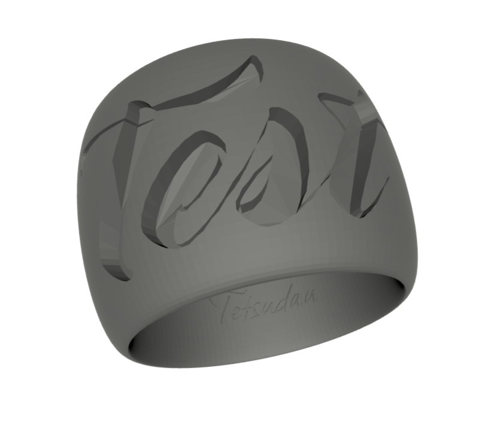

# SVG Tag Generator

The SVG Tag Generator is a versatile Python library designed for creating and manipulating SVG (Scalable Vector Graphics) files. It provides a range of functionalities to generate business cards, diving tags, rings, Wi-Fi QR codes, and more, with customizable text and design elements.

## Features

- Generate SVG files for various use cases, including business cards, diving tags, and rings.
- Convert SVG content to multiple formats such as PNG, JPG, PDF, EPS, and DXF.
- Create Wi-Fi QR codes with embedded network details.
- Perform 3D transformations and visualizations of SVG elements.
- Export and manage SVG content efficiently.

## Installation

To use the SVG Tag Generator, clone the repository to your local machine and ensure that you have Python installed. Some scripts may require additional dependencies, which can be installed using `pip`:

```bash
git clone https://github.com/your-username/SVGtag.git
cd SVGtag
pip install -r requirements.txt
```
### Dependencies
The SVG Tag Generator relies on several third-party libraries to provide its functionality with special thanks to:
- [FontTools](https://github.com/fonttools/fonttools): A library for manipulating fonts, supporting TrueType, OpenType, AFM and to an extent Type 1 and some Mac-specific formats.
- [Trimesh](https://github.com/mikedh/trimesh): A library for loading and using triangular meshes with an emphasis on watertight surfaces and fast operations.


## Modules
The SVG Tag Generator consists of several modules, each tailored for specific functionalities:
- SVGprocess: Core module for creating and manipulating SVG content.
- shape2svg: Functions to generate SVG shapes with customizable dimensions and styles.
- text2svg: Convert text into SVG paths using various fonts and styles.
- generators: Submodules for generating specific SVG items like rings, tags, and Wi-Fi QR codes.
- scripts: Utility scripts for exporting SVG to different formats and batch processing.

## Usage
Here are some examples of how to use the SVG Tag Generator:

## Usage Examples

The following examples demonstrate how to use the SVG Tag Generator to create various SVG elements and perform operations such as 3D transformations and exporting to different formats.

### Generating a Tag with a Circular Shape


```python
from SVGtag.shape2svg import shape_svg

# Define the dimensions and properties for the tag
width_mm = 80
height_mm = 35
thk = 1
shape = 'circle'
phi = 5

# Generate an SVG tag with the specified properties
svg = shape_svg(width_mm, height_mm, thk, shape, phi)
svg.unit = 'mm'
svg.width = width_mm
svg.height = height_mm
svg.viewBox = [0, 0, width_mm, height_mm]

# Save the SVG tag to a file
output_path = 'path/to/output/directory'
svg_file_path = os.path.join(output_path, 'shape.svg')
svg.generate_svg_file(svg_file_path)
```

### Creating a Wi-Fi QR Code with Embedded Network Details


```python
from SVGtag.generators.wifi import QR_gen

# Define Wi-Fi network details and SVG properties
network = 'MyNetwork'
password = 'MyPassword'
protocol = 'WPA/WPA2'
hidden = 'true'
width_mm = 100
height_mm = 100
padding_mm = 5
text_elements = [
    # Define text elements to include in the SVG
]

# Generate the Wi-Fi QR code SVG
svg_instance = QR_gen(network, password, protocol, hidden, text_elements, width_mm, height_mm, padding_mm, static_files_path)

# Save the Wi-Fi QR code SVG to a file
output_path = 'path/to/output/directory'
output_file = os.path.join(output_path, 'wifi_qr_code.svg')
svg_instance.generate_svg_file(output_file)
```

### Creating a Personalized Ring with Text Engraving (for napkins ring for instance)



```python
from SVGtag.generators.ring import ring, export

# Define the parameters for the ring
diameter = 20  # Diameter of the ring in millimeters
height = 10    # Height of the ring in millimeters
thickness = 2  # Thickness of the ring in millimeters
res = 20       # Resolution for the 3D mesh
font_dir = 'path/to/font/directory'  # Directory containing font files
font = 'OpenSans-Regular.ttf'        # Font file for the text engraving
text = "Your Text Here"              # Text to engrave on the ring

# Define the output path for the generated files
output_path = 'path/to/output/directory'
os.makedirs(output_path, exist_ok=True)  # Create the directory if it does not exist
filename = "custom_ring"  # Base filename for the output files

# Generate the ring with the specified parameters
mesh = ring(text, diameter, height, thickness, res, font_dir, font, output_path, filename, shape=1, brand=True, vis=False)

# Export the ring to an STL file for 3D printing
export(mesh, style='stl', path=output_path, name=filename)
```

### Generating a Business Card

```python
from SVGtag.examples.business_cards import generate_participant_cards

# Define card details
name = 'John Doe'
title = 'Software Engineer'
discipline = 'Development'
location = 'New York, USA'

# Generate the business card
generate_participant_cards(name, title, discipline, location, 'output_directory', 'card_name')
```

### Creating a Tag

```python
from SVGtag.examples.etiquettes_plongee import batch_tags

# Define tag data
data = [
    {"Catégorie": "Safety", "Id": 1, "Recto": "Are you ok?", "Verso": "I'm not ok!"}
    # Add more tags as needed
]

# Generate diving tags
batch_tags(data)
```

### Exporting SVG Content

```python
from SVGtag.SVGprocess import SVG

# Create an SVG instance
svg_instance = SVG()

# Add elements to the SVG
svg_instance.add_rectangle(x=0, y=0, width=100, height=100, stroke="black", fill="none")

# Export the SVG to a file
svg_instance.generate_svg_file('output.svg')
```

# Contributing
Contributions to the SVG Tag Generator are welcome. If you have a bug report, feature request, or a pull request, please feel free to contribute.
